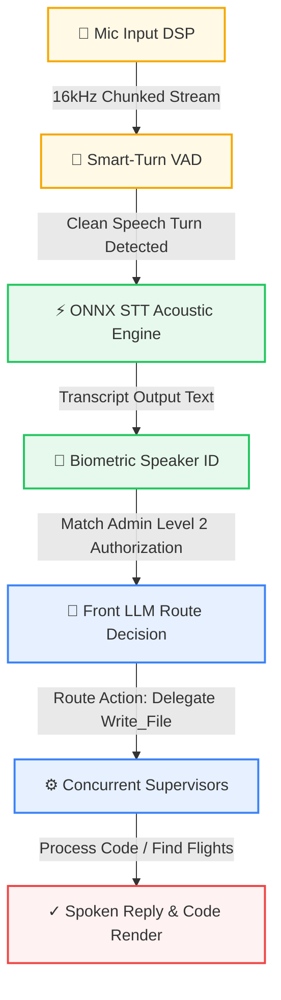
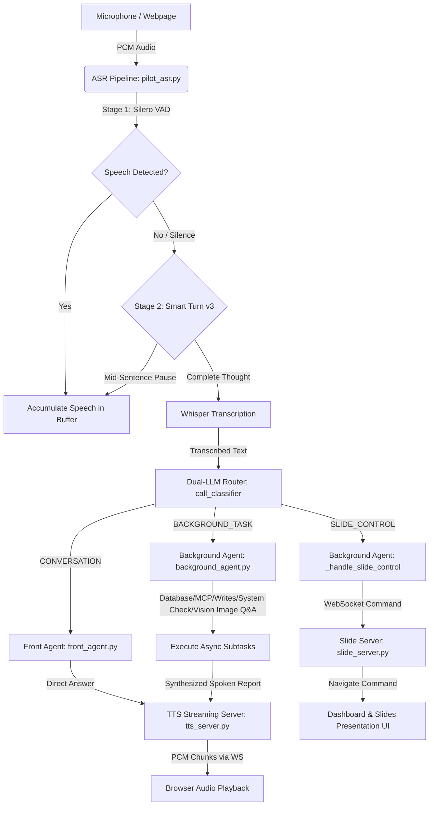
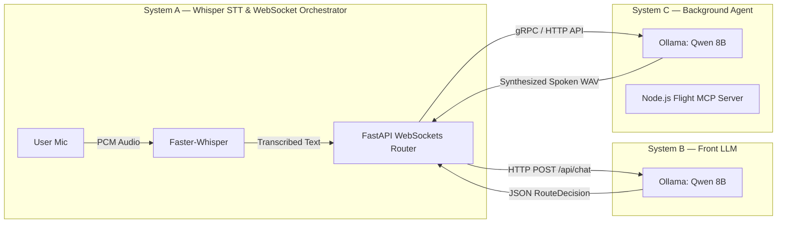
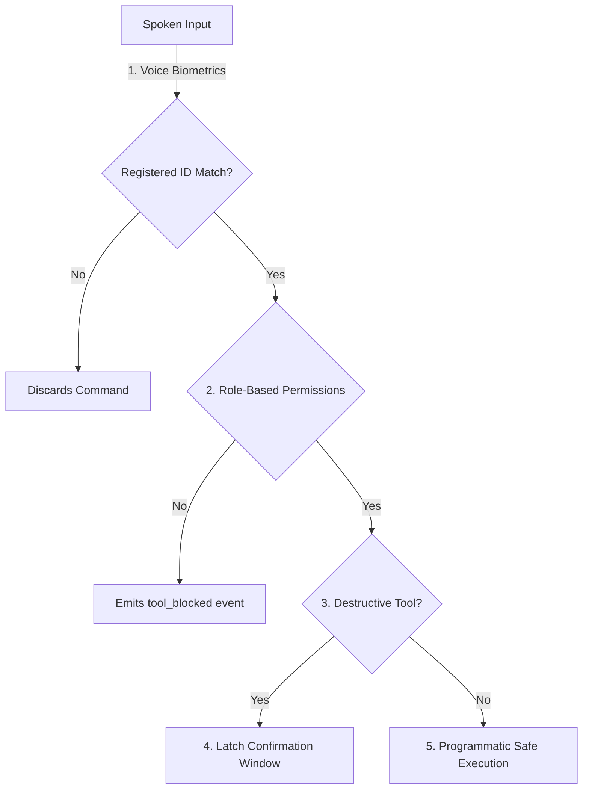
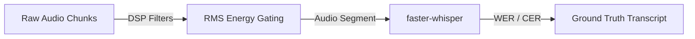

# PILOT Architectural Diagrams, Layout Maps & Performance Tables
This document preserves all core tables, wireframe layouts, and pipeline diagrams generated for PILOT Voice OS.

---

## 1. Main Dashboard Wireframe Layout
*Based on the approved design wireframe mockup*

```
+-------------------------------------------------------------------------------+
|                                 PAGE HEADER                                   |
+------------------------------------------------------+------------------------+
|                                                      |   ✦ Tools Card         |
|                                                      |   - PPT Copilot        |
|                                                      |   - Customer Care      |
|                 📋 Transcript section                |                        |
|                                                      +------------------------+
|                 - General chat logs                  |   ⊙ Queue Card         |
|                 - Inline code generators             |   - Pending Jobs       |
|                 - Dual-level visual scroll bounds    |   - Complete Jobs      |
|                                                      |   - Dual-scroll lock   |
|                                                      |                        |
+------------------------------------------------------+------------------------+
|                                                                               |
|                            🕒 Recent sessions                                 |
|                                                                               |
|     - Full-width scroll list                                                  |
|     - Complete AI session summaries                                           |
|     - Highlighted unsummarized background task details                        |
|                                                                               |
+-------------------------------------------------------------------------------+
```

---

## 2. Dynamic Cognitive Sandbox Trace
*The real-time processing sequence executed on the interactive virtual sandbox*



---

## 3. Core Architecture Pipeline
*Layer mapping of the PILOT Engine*

| Layer Name | Execution Domain | Sub-Systems / Technologies | Purpose |
| :--- | :--- | :--- | :--- |
| **1. Audio DSP Pipeline** | Local Edge | Raw 16kHz Chunking, model-based VAD parameters, ONNX Acoustic STT | Evaluates continuous input stream and extracts clean spoken strings |
| **2. Cognitive Front LLM** | Cloud / Local | Classifier Gateway, Groq Llama-3.1-8B, Biometric verification | Resolves user intent, authorizes access levels, delegates tools |
| **3. Concurrent Supervisors** | Cloud Background | File I/O Workers, MCP Web Services, PowerPoint Supervisors | Executes programmatic tasks asynchronously without blocking voice |

---

## 4. Background Task Latency Profile
*Actual logged performance averages recorded under `audit_log`*

| Task / Tool Name | Latency (ms) | Speed Class | Subsystem Handler |
| :--- | :--- | :--- | :--- |
| **`ppt_navigate`** / **`ppt_jump_to_title`** | **$0.0$ ms** | 🚀 Instantaneous | Local socket context dispatch |
| **`kb_search`** | **$0.0$ ms** | 🚀 Instantaneous | Fast index search query |
| **`database_query`** | **$257.7$ ms** | ⚡ Very Fast | SQLite async engine |
| **`general_qa`** | **$455.4$ ms** | ⚡ Very Fast | Prompt context construction |
| **`write_file`** (Code Gen) | **$557.4$ ms** | ⚡ Very Fast | Real-time script writer |
| **`system_check`** | **$1,195.6$ ms** | ⏱️ Moderate | Filesystem index scanner |
| **`ppt_qa`** | **$1,225.6$ ms** | ⏱️ Moderate | PPT content extractor |
| **`flight_search`** | **$1,819.8$ ms** | ⏱️ Moderate | Node MCP Web integration |

---

## 5. System Architecture & Dual-LLM Routing
*Complete execution flow mapping from sound collection to client presentation updates*



---

## 6. Distributed Cloud & Edge Architecture
*Physical partition of STT engines, LLM microservices, and client communication channels*



---

## 7. Voice Biometric & Guardrails System
*Sequence diagram of security authorization gateways*



---

## 8. Local Audio DSP Filter Pipeline
*Local audio cleaning structure*


