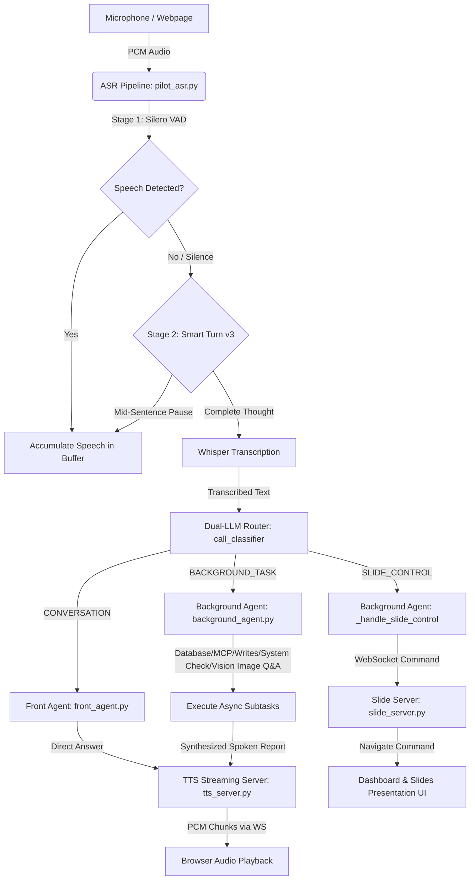
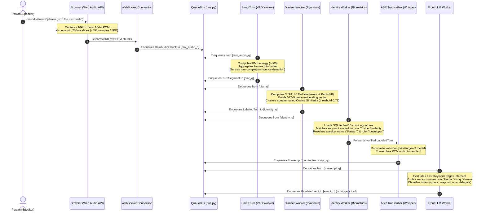
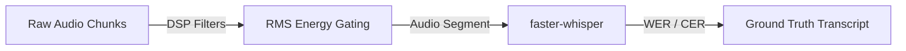
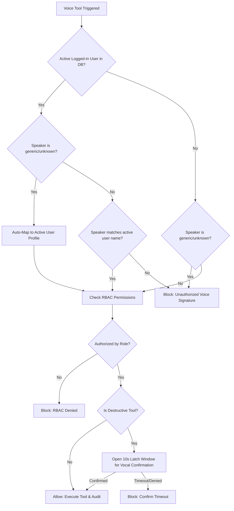
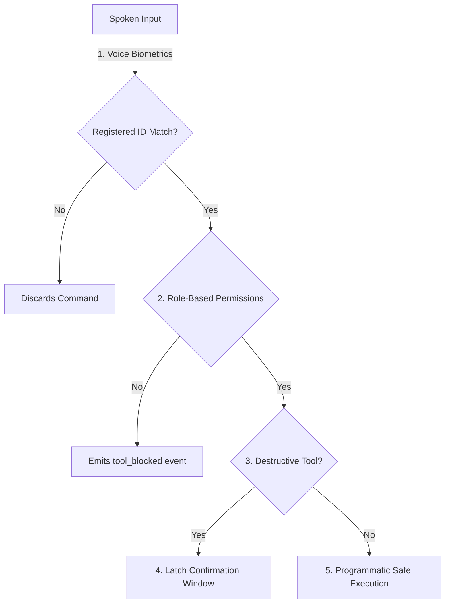
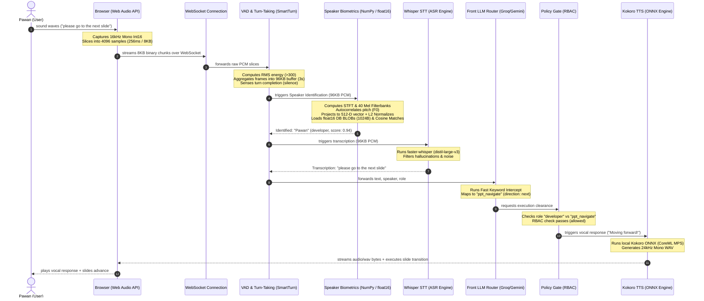

# PILOT — Portable Intelligent Listener for Open Tasking

> **Grid Dynamics Capstone 2026 · Team of 6 (3 DS · 2 FSE · 1 DevOps)**
>
> Always-on ambient voice AI copilot. Identifies active speakers biometrically. Reacts in under 300ms.
> Delegates long-running background tasks securely behind a robust Role-Based Access Control (RBAC) policy gate.

---

## Table of Contents

1. [System Architecture](#1-system-architecture)
2. [What PILOT Is](#2-what-pilot-is)
3. [End-to-End Voice Pipeline](#3-end-to-end-voice-pipeline)
4. [Component Deep Dive & Model Specifications](#4-component-deep-dive--model-specifications)
5. [Talkinia Meeting Space Micro-Frontend](#5-talkinia-meeting-space-micro-frontend)
6. [Folder Directory Structure](#6-folder-directory-structure)
7. [Use Cases Deep Dive & Sequence Traces](#7-use-cases-deep-dive--sequence-traces)
8. [Getting Started & Local Installation](#8-getting-started--local-installation)
9. [Provider Swap Matrix](#9-provider-swap-matrix)
10. [API & WebSocket Reference](#10-api--websocket-reference)
11. [Architectural Decisions: Why FastAPI Monolith](#11-architectural-decisions-why-fastapi-monolith)

---

## 1. System Architecture

Below is the high-level system architecture of PILOT, showing how audio feeds into the ASR pipeline, routes through the dual-LLM decision gate, executes background tasks, and streams audio back to the browser.



---

## 2. What PILOT Is

PILOT is a **real-time, always-on voice pipeline** rather than a push-to-talk voice assistant or simple wake-word listener. The client microphone remains open continuously. The system listens in the background, separates speakers by voice characteristics, transcribes audio streams, classifies user intent, protects operations behind role permissions, and executes asynchronous tools, while keeping the local conversational audio response latency under 300ms.

---

## 3. End-to-End Voice Pipeline

The voice pipeline is structured as an asynchronous, decoupled producer-consumer queue network managed via `backend/queues/bus.py`. Below is the step-by-step sequence of voice data, from initial capture to the final routing decision:



### The Queue Bus Nerval System
PILOT coordinates in-process data transmission using five distinct `asyncio.Queue` back-pressure gates:

| Queue | Data Type | From → To | Purpose |
|---|---|---|---|
| `raw_audio_q` | `RawAudioChunk` | WebSocket Audio Handler → Silero VAD | Continuous ingestion of raw microphone input. |
| `turn_q` | `TurnSegment` | VAD Worker → SmartTurn → Diarizer | Grouped audio chunks containing active speech. |
| `labeled_turn_q`| `LabeledTurn` | Diarizer & Identity Workers → ASR | Audio segments tagged with speaker identity and roles. |
| `transcript_q` | `TranscriptSpan`| ASR Worker → Front LLM | Transcribed text and metadata ready for routing. |
| `event_q` | `PipelineEvent` | All Workers → WebSocket Events → Browser | Real-time visual, task, and audio feedback events. |

---

## 4. Component Deep Dive & Model Specifications

### A. Audio Ingestion & DSP Gating
* **Microphone Capture**: The browser captures input using the Web Audio API at **16kHz, mono, 16-bit signed integer PCM** (32 bytes per millisecond). Audio is packaged into 256ms slices and streamed over a binary WebSocket connection.
* **Silero VAD (Energy Gate)**: Consumes raw PCM frames. Uses **Silero VAD v4** (`silero_vad.onnx`) running locally via ONNX Runtime inside `backend/services/vad.py`. It computes the Root-Mean-Square (RMS) energy. An energy reading $>300$ triggers active turn accumulation.
* **Smart Turn (Semantic Turn-Taking)**: Incorporates linguistic completeness heuristics in `backend/pipeline/vad/smart_turn.py`. Instead of cutting off speech during natural pauses, Smart Turn delays turn packaging if an utterance is syntactically incomplete, ensuring smooth dialogue flow.



### B. Speaker Diarization & Identity Resolution
* **Diarization Engine**: Uses **Pyannote.audio** for online unsupervised speaker clustering in `backend/services/diarizer.py` (with **NVIDIA Sortformer** as a stub fallback). It maps audio slices into pseudo-labels (e.g., `spk-0`, `spk-1`).
* **Feature Extraction (WeSpeaker)**: Uses the **WeSpeaker ECAPA-TDNN** model in `backend/services/enrollment.py` to calculate a **512-dimensional float32 voice fingerprint** (using STFT, 40 Mel-scale Filterbanks, and pitch autocorrelation $F_0$).
* **Identity Matching**: The system loads enrolled user signatures from the SQLite database (stored as float16 arrays) and calculates **cosine similarity**:
  $$\text{Similarity} = \frac{\mathbf{A} \cdot \mathbf{B}}{\|\mathbf{A}\| \|\mathbf{B}\|}$$
  * If $\text{score} \ge 0.82$, the speaker is mapped to their name and role.
  * If $\text{score} < 0.82$, it is labeled as `spk-unknown`.
  * **Fallback**: Unregistered voices are mapped to `customer` with zero tool permissions, preventing unauthorized execution. If an active session user is logged in, generic labels are safely mapped to the active user to maintain continuity.

### C. Speech-to-Text (ASR)
* **Primary STT**: Runs **faster-whisper** loaded with the **Whisper `small`** model (`small` in active config, with fallback options like `distil-large-v3` or `large-v3-turbo` in the STT interface).
* **Execution**: Offloaded to a separate CPU thread via `asyncio.to_thread` to prevent blocking FastAPI's main event loop.
* **Dual-Write Persistence**: Transcribed spans are written simultaneously to an in-memory ring buffer (`collections.deque(maxlen=50)`) for fast LLM context access and to the permanent SQLite `transcript_logs` table for auditing.

### D. Front LLM Router & Intent Classification
* **Model**: **Qwen 7B** or **Llama 3.2** running locally via Ollama (`OLLAMA_MODEL=qwen2.5:7b` or `llama3.2:latest` in `.env`).
* **Fast-Path Routing**: A case-insensitive regex-based **Fast Keyword Intercept Router** in `front_llm.py` intercepts slide navigation commands immediately, bypassing LLM processing to achieve sub-50ms reaction times.
* **Intent Classification**: Spans not caught by the regex route to Ollama, returning a structured JSON payload:
  * `ignore`: Drops background noise or conversational filler.
  * `respond_now`: Generates a conversational response.
  * `delegate`: Submits a structured command to the background task runner.

### E. Policy Gate & Robust RBAC
Before any tool execution, the system evaluates role permissions and destructive commands:



* **Destructive Tool Latching**: Tools listed in `DESTRUCTIVE_TOOLS` (e.g., `flight_book`, `ppt_delete_slide`) open a 10-second verification window. The system demands a verbal confirmation (*"yes confirm"*) from the **exact same speaker** who initiated the action. If a different voice speaks, or the timeout expires, the task is blocked:



### F. Background Agent Concurrency
* **Model**: **Google Gemini 2.5** (`gemini-2.5-flash` primary) or **Groq Llama 3.1** (`llama-3.1-8b-instant` fallback).
* **Supervisor (`bg_supervisor.py`)**: Schedules tasks concurrently.
  * `mode: queue`: Enqueues the task in a FIFO queue behind active operations.
  * `mode: interrupt`: Instantly cancels running tasks (`asyncio.Task.cancel()`) and executes the new command immediately.

### G. Text-to-Speech (TTS) & Barge-In
* **Primary TTS**: **Edge TTS** (Microsoft Neural TTS) to stream audio chunks immediately. First audio arrives at the browser in ~200ms.
* **Offline Fallback**: **Kokoro v1.0 ONNX** (`kokoro-v1.0.onnx` 82M params) running locally via ONNX Runtime.
* **Barge-In Interruption**: Managed via `core/cancel_tokens.py`. If a user speaks while TTS is playing, a cancellation event cancels the active TTS task, clears the browser's audio buffer, and opens the microphone for the new voice input.

### H. AI Presentation Slide Creator & Image Generation
* **Dynamic Slide Generation Cascade**: Generates slide presentation outlines dynamically from a single text prompt using cloud Gemini (`gemini-2.5-flash`), cloud Groq Llama 3.3 (`llama-3.3-70b-versatile`), or local Ollama (`OLLAMA_MODEL`) models.
* **Keyless AI Image Generation**: Integrated with **Pollinations AI (Flux)** to dynamically generate professional slide graphics, icons, 3D objects, or diagrams matching the slide content automatically, without requiring API keys.
* **Auto-Fallback & Rate-Limit Handling**: Includes exponential backoff retries with random jitter to handle `429 Too Many Requests` API limits, cascading down to a default model or a high-quality Unsplash corporate graphic placeholder to guarantee slide rendering layout integrity.
* **Widescreen Side-by-Side Design Layout**: Compiled using `python-pptx`. Slide text bullets are dynamically sized and shifted left to make space for the generated image on the right.
* **Widescreen Slide Theme**: Set to pure white backgrounds (`#FFFFFF`) with high-contrast dark charcoal text (`#111112`) and dark amber accents (`#D4900F`) for optimal visual appeal and readability.
* **Fullscreen Presentation Mode**: Supported via HTML5 Fullscreen API, including a YouTube-style double-arrow expand/collapse button (`⤢` / `⤣`) and a floating corner voice-activated microphone control for seamless hands-free presenting.

---

## 5. Talkinia Meeting Space Micro-Frontend

Talkinia is a collaborative virtual video meeting space integrated directly into PILOT's interface:

* **Micro-Frontend Architecture**: Built as a Next.js application running on **port 3000**, embedded within PILOT's workspace using a secure iframe.
* **Bidirectional Route Synchronization**: Uses the HTML5 `postMessage` API. When a user navigates inside the meeting workspace, the iframe transmits route changes to the parent window to keep the browser URL synchronized (e.g., `/meetings/room-id`). In reverse, parent popstate events update the iframe's target source.
* **User Context Handshake**: The parent window passes verified user details (`user_id`, `user_name`, `user_email`, `user_role`) to the iframe via query parameters, logging the user in automatically.
* **Silent In-Meeting Listening**: When a meeting session is active (session ID starting with `meeting_`), PILOT disables spoken voice feedback to avoid interrupting the meeting audio. Instead, it performs background transcription, diarization, and speaker tracking.
* **Voice Triggers**:
  * *"start meeting / join meeting"*: Opens the Talkinia workspace immediately.
  - *"summarize the meeting / compile actions"*: Triggers the `compile_minutes` tool. It processes the meeting transcript, maps speaker identities, compiles structured meeting minutes, emails them to all participants, and caches the records locally.

---

## 6. Folder Directory Structure

```
PILOT/
├── Makefile                         Convenience scripts for starting frontend and backend
├── README.md                        Detailed system architecture and developer documentation
│
├── backend/                         Primary backend directory
│   ├── main.py                      FastAPI application entry point & lifecycle hooks
│   ├── requirements.txt             Python dependencies
│   ├── pyproject.toml               Linter and test configurations
│   ├── .env.example                 Environment variable template
│   │
│   ├── core/                        Core system orchestrators
│   │   ├── config.py                Application settings and environment configurations
│   │   ├── session_manager.py       Active session registry
│   │   ├── session_state.py         Audio ring buffers and session lifecycle states
│   │   ├── audio_fanout.py          Distributes PCM audio to ASR and VAD engines
│   │   ├── cancel_tokens.py         Coordinates voice barge-in interruptions
│   │   ├── bg_supervisor.py         Concurrent background task scheduler
│   │   ├── persistence.py           Saves and loads session states to survive reconnects
│   │   ├── ws_manager.py            WebSocket connection pooling
│   │   └── security.py              JWT utilities and passwords hashing
│   │
│   ├── services/                    AI model services and interfaces
│   │   ├── vad.py                   Silero VAD interface
│   │   ├── stt.py                   Whisper ASR interface
│   │   ├── tts.py                   Edge TTS / Kokoro TTS interface
│   │   ├── diarizer.py              Pyannote speaker diarization interface
│   │   ├── enrollment.py            WeSpeaker voice embedding & identity resolver
│   │   ├── front_llm.py             Front LLM routing prompts & provider mappings
│   │   └── bg_agent.py              Background LLM agent interface (Gemini/Groq)
│   │
│   ├── pipeline/                    Asynchronous pipeline workers
│   │   ├── vad/
│   │   │   ├── silero_vad.py        Energy-based voice activity detection
│   │   │   └── smart_turn.py        Linguistic completeness evaluator
│   │   ├── diarizer.py              Segments audio into speaker turns
│   │   ├── identity_resolver.py     Resolves voice embeddings to names and roles
│   │   ├── asr_worker.py            Transcribes audio to text using Whisper
│   │   └── front_llm.py             Executes intent routing decisions
│   │
│   ├── tools/                       Action tools and security policies
│   │   ├── registry.py              Global dictionary of available tools
│   │   ├── policy.py                RBAC permissions check & destructive tool confirmation
│   │   ├── ppt_copilot.py           PowerPoint control tools (navigate, delete, generate)
│   │   ├── flight_booking.py        Flight searches and bookings
│   │   ├── tickets.py               Support ticket management
│   │   └── crm.py                   Customer information lookup
│   │
│   ├── api/                         REST & WebSocket endpoints
│   │   ├── auth.py                  Registration, login, and OTP verification
│   │   ├── sessions.py              Session management endpoints
│   │   ├── ws_audio.py              Binary PCM WebSocket endpoint
│   │   └── ws_events.py             JSON event broadcast WebSocket endpoint
│   │
│   ├── db/                          Database engine and schemas
│   │   ├── engine.py                SQLAlchemy async connection manager
│   │   └── models.py                Database schemas (User, AuditLog, TranscriptLog)
│   │
│   └── queues/
│       └── bus.py                   Shared async queue definitions (QueueBus)
│
├── frontend/                        Primary frontend directory
│   ├── vite.config.ts               Vite configurations and api/ws proxies
│   ├── package.json                 Frontend npm package manifest
│   └── src/
│       ├── app.tsx                  Application router and state initializers
│       ├── ws_client.ts             Coordinates WebSocket event dispatches
│       ├── audio_capture.ts         Web Audio API collector (PCM streaming)
│       ├── components/
│       │   ├── TranscriptOverlay.tsx Live scrolling transcripts with speaker tags
│       │   ├── ToolStatusCard.tsx    Interactive flight, email, and task cards
│       │   ├── BacklogQueue.tsx      Sidebar displaying queued background tasks
│       │   ├── PPTView.tsx           PowerPoint copilot view
│       │   └── transcript/
│       │       ├── GuidelinePageView.tsx System Guidelines view
│       │       ├── CustomerCareView.tsx  Flight booking and customer care view
│       │       ├── EmailPageView.tsx     Email composition and history view
│       │       └── MeetingsPageView.tsx  Talkinia meeting micro-frontend container
│       └── store/
│           └── SessionStore.ts      Global Zustand state store
│
├── TALKINIA_STREAM/                 Talkinia Meeting Space (Next.js 14)
│   ├── package.json                 Next.js dependency list
│   └── components/
│       ├── MeetingRoom.tsx          RTC video conference room
│       └── MeetingTypeList.tsx      Meeting control panel (Start, Schedule, Join)
│
└── diagrams/                        Mermaid source files for documentation
```

---

## 7. Use Cases Deep Dive & Sequence Traces

### Use Case A: PPT Copilot Slide Control
This trace demonstrates the distinction between conversational noise ("and next we should discuss...") and an explicit voice command ("go to the architecture slide"):



### Use Case B: Customer Care & Flight Search
This trace shows a two-speaker duplex scenario where the Customer Care representative initiates a flight search and booking:
1. **CSR Alice** (role: `csr`) and **Customer Bob** (role: `customer`) are speaking simultaneously.
2. Diarization separates `spk-0` (Alice) and `spk-1` (Bob).
3. Bob says: *"Please book flight FL001 for me."* The Front LLM classifies `flight_book`. The Policy Gate blocks the request because Bob's role has insufficient permissions, emitting a `tool_blocked` event.
4. Alice says: *"Search flights from Mumbai to Delhi on July 1st."* The Policy Gate allows it. The background agent queries flight information and returns interactive search cards.
5. Alice says: *"Book flight FL001 for Bob Smith."* The Policy Gate detects that `flight_book` is destructive and opens a 10-second confirmation window.
6. Alice says: *"yes confirm"*. The Policy Gate verifies that the voice fingerprint matches Alice and executes the booking, updating the UI.

---

## 8. Getting Started & Local Installation

### Prerequisites
* **Python 3.11+**
* **Node.js 20+**
* **Ollama** installed and running on the host system
* **ffmpeg** installed (required for audio processing)
* **LibreOffice** installed on the host system (required for PPT slide rendering and generation):
  * **macOS**: Install via Homebrew: `brew install --cask libreoffice`
  * **Linux (Ubuntu/Debian)**: Install via APT: `sudo apt-get update && sudo apt-get install -y libreoffice`
  * **Windows**: Download the official installer from the LibreOffice website and add the installation directory containing `soffice.exe` to your system `PATH`.

### A. Environment Configuration
Create a `.env` file inside the `backend` directory:
```bash
cd backend
cp .env.example .env
```
Update `.env` with your API keys:
```ini
SECRET_KEY=your_jwt_secret_key_here
DATABASE_URL=sqlite+aiosqlite:///./data/pilot.db

# Speech and Model Providers
ASR_PROVIDER=whisper
TTS_PROVIDER=edge_tts
DIAR_PROVIDER=pyannote
EMBED_PROVIDER=wespeaker
FRONT_LLM_PROVIDER=ollama
BG_LLM_PROVIDER=gemini

# Models Config
WHISPER_MODEL=small
OLLAMA_MODEL=qwen2.5:7b
OLLAMA_BASE_URL=http://127.0.0.1:11434

# External API Keys (Required for background agent and searches)
GEMINI_API_KEY=your_gemini_api_key_here
TAVILY_API_KEY=your_tavily_api_key_here
```

### B. Backend Setup
```bash
# 1. Create and activate a virtual environment
python3 -m venv .venv
source .venv/bin/activate

# 2. Install dependencies
pip install -r requirements.txt

# 3. Pull required local models via Ollama
ollama serve
ollama pull qwen2.5:7b

# 4. Start the FastAPI server
uvicorn backend.main:app --host 0.0.0.0 --port 8000 --reload
```
*Note: If `SMTP_USER` is not configured in `.env`, registration OTPs will print directly to the backend terminal console for development convenience.*

### C. Frontend Setup (React Vite)
```bash
cd frontend
npm install
npm run dev
```
The React development server runs on `http://localhost:5173`, automatically proxying API and WebSocket traffic to port 8000.

### D. Talkinia Meeting Space Setup (Next.js)
```bash
cd TALKINIA_STREAM
npm install
npm run dev
```
The Next.js meeting micro-frontend runs on `http://localhost:3000`.

---

## 9. Provider Swap Matrix

All core AI components are decoupled behind clean interfaces. Swapping a service provider requires changing only a single environment variable in `.env` without modifying code:

| Subsystem | Environment Variable | Development Default (Local) | Cloud Alternative |
|---|---|---|---|
| **STT / ASR** | `ASR_PROVIDER` | `whisper` (Faster-Whisper small) | Deepgram / AssemblyAI |
| **VAD** | `VAD_PROVIDER` | `smart_turn` (Energy + Heuristics)| Bundled cloud real-time APIs |
| **Diarization** | `DIAR_PROVIDER` | `pyannote` (Local Pyannote.audio) | AssemblyAI Diarize |
| **Speaker Embed**| `EMBED_PROVIDER` | `wespeaker` (ECAPA-TDNN) | Resemble AI |
| **Front LLM** | `FRONT_LLM_PROVIDER` | `ollama` (Local Qwen / Llama) | Azure OpenAI / GPT-4o-mini|
| **Back LLM** | `BG_LLM_PROVIDER` | `gemini` (Gemini 2.5 Flash) | Groq Llama 3.1 / GPT-4o |
| **TTS** | `TTS_PROVIDER` | `edge_tts` (Microsoft Neural TTS) | ElevenLabs |

---

## 10. API & WebSocket Reference

### A. REST Endpoints

| Method | Endpoint | Description |
|---|---|---|
| **POST** | `/api/v1/auth/signup` | Register a new account and trigger an OTP. |
| **POST** | `/api/v1/auth/verify-otp` | Verify the OTP and return a session JWT. |
| **POST** | `/api/v1/auth/login` | Login and return a session JWT. |
| **POST** | `/api/v1/sessions` | Create a new session (`{usecase}`). |
| **DELETE**| `/api/v1/sessions/{id}` | Terminate an active session. |
| **POST** | `/api/v1/enrollment/start` | Begin voice enrollment for a user (`{name, role}`). |
| **POST** | `/api/v1/enrollment/audio` | Submit audio calibration chunks. |
| **POST** | `/api/v1/enrollment/finalize/{id}`| Complete voice enrollment and save signature. |
| **GET** | `/api/v1/transcripts/{session_id}`| Retrieve the full text transcript of a session. |
| **POST** | `/api/v1/ppt/navigate` | Submit manual PowerPoint slide navigation commands. |
| **POST** | `/api/v1/flights/search` | Search flight schedules. |
| **POST** | `/api/v1/flights/book` | Book a flight (requires authorization). |

### B. WebSocket Connections

* **Audio Stream**: `/ws/audio/{session_id}` (Client $\rightarrow$ Server) — Streams raw binary 16kHz mono 16-bit PCM chunks.
* **Event Stream**: `/ws/events/{session_id}` (Server $\rightarrow$ Client) — Broadcasts JSON pipeline event payloads:
  * `transcript`: `{text, speaker, role, confidence, timestamp}`
  * `tool_start`: `{job_id, tool, speaker, role}`
  * `tool_end`: `{job_id, tool, result, latency_ms}`
  * `job_queued`: `{job_id, tool, requester, mode}`
  * `confirm_prompt`: `{tool, speaker, message}`
  * `ppt_command`: `{action, index}`
  * `tts_audio`: `{chunk: number[]}`
  * `tool_blocked`: `{tool, speaker, reason}`

---

## 11. Architectural Decisions: Why FastAPI Monolith

PILOT is designed deliberately as a **single-process FastAPI monolith** rather than a network of microservices. This choice is driven by strict latency and concurrency requirements:

1. **Zero-Latency Event Hops**: All queues are local `asyncio.Queue` objects. Moving data between pipeline stages takes nanoseconds. Incorporating an external message broker (e.g., RabbitMQ, Kafka) would add 30-80ms of network serialization overhead per hop. With a strict 300ms total budget across 6 stages, broker overhead is unacceptable.
2. **Zero-Copy Context Access**: The Front LLM needs instant access to the session ring buffer. In a monolith, this is a local memory lookup taking microseconds. In a microservices architecture, this would require an HTTP or database query, adding 10-50ms of latency.
3. **Single-Writer Database Efficiency**: SQLite is used for local data storage. It operates extremely fast but is single-writer. A monolith handles database access safely through a single event loop, whereas microservices would force a migration to a complex distributed database.
4. **Clean Provider Seams**: Swap-ability is handled programmatically. If a local model bottleneck arises (e.g., Whisper STT), it can be moved to an external GPU server by swapping the provider class configuration in `.env` without modifying the core pipeline orchestrator.

---
*PILOT — Grid Dynamics Capstone 2026*


make frontend-dev                                               
cd frontend && npm run dev
cd frontend && npm run dev


cd TALKINIA_STREAM 
rm -rf .next                                                    
npm run dev


                             
cd /Users/pagupta/Desktop/capstone_major_sare_hai/PILOT
source .venv/bin/activate
uvicorn backend.main:app --host 0.0.0.0 --port 8000 --reload


ollama serve