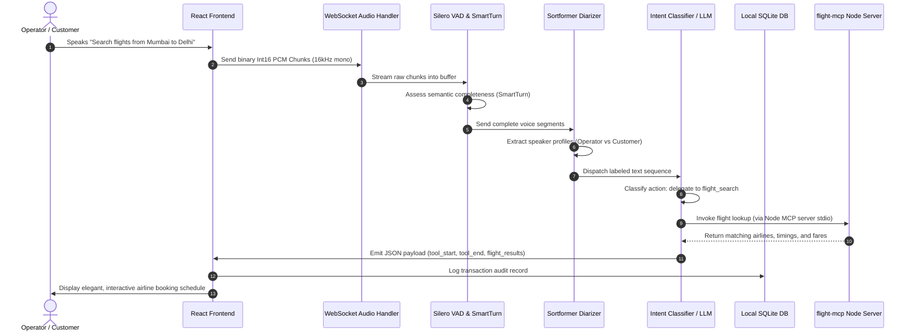

# PILOT — Customer Care & Flight Center Module

> **Component Operator Manual & Engineering Guide**
> Part of the PILOT (Portable Intelligent Listener for Open Tasking) Voice AI OS platform.

---

## 📖 Table of Contents
1. [Overview](#1-overview)
2. [End-to-End System Architecture](#2-end-to-end-system-architecture)
3. [Key Features & Capabilities](#3-key-features--capabilities)
4. [Tool & API Directory](#4-tool--api-directory)
5. [Frontend Components & React Interface](#5-frontend-components--react-interface)
6. [Voice Pipeline Integration (Silero VAD + SmartTurn)](#6-voice-pipeline-integration)
7. [MCP integration (Model Context Protocol)](#7-mcp-integration)
8. [Database Schema](#8-database-schema)
9. [Operator Guideline & Sandbox Presets](#9-operator-guideline--sandbox-presets)

---

## 1. Overview

The **Customer Care & Flight Center** is a cornerstone duplex-voice module of the PILOT system. It acts as an ambient-intelligence platform designed for Customer Service Representatives (CSRs). By operating in an always-on audio duplex environment, it listens to raw speech, maps conversation participants via Speaker Diarization, and intelligently executes transactional tools (like flight searches, ticket creations, and CRM verifications) in the background without interrupting the live customer-agent loop.

```
┌────────────────────────────────────────────────────────┐
│                   ALWAYS-ON DUPLEX MIC                 │
└──────────────────────────┬─────────────────────────────┘
                           ▼
┌────────────────────────────────────────────────────────┐
│     Voice Activity Detection & SmartTurn Buffering     │
└──────────────────────────┬─────────────────────────────┘
                           ▼
┌────────────────────────────────────────────────────────┐
│         Speaker Diarization (User vs. Agent)          │
└──────────────────────────┬─────────────────────────────┘
                           ▼
┌────────────────────────────────────────────────────────┐
│          Intent Classification & LLM Routing           │
└──────────────────────────┬─────────────────────────────┘
                           ▼
┌────────────────────────────────────────────────────────┐
│  CRM Lookups · KB Searches · Flight Queries · Tickets  │
└────────────────────────────────────────────────────────┘
```

---

## 2. End-to-End System Architecture

The following Mermaid diagram traces the end-to-end data flow when a customer care operator speaks a command or registers information:



---

## 3. Key Features & Capabilities

*   **⚡ Sub-300ms Low-Latency Dispatch**: Processes raw voice waves to visual flight grids in real-time.
*   **🗣️ Ambient Diarized Filtering**: Segregates Customer voice waves from the Operator (Agent) voice, restricting tool activation commands strictly to authorized agent roles.
*   **📋 CRM Context Matching**: Instantly triggers lookups (`crm_lookup`) to map spoken names or customer IDs to Gold/Silver tier records.
*   **🛠️ Background Ticketing Integration**: Creates and updates support logs behind-the-scenes using conversational cues (e.g., "Open a general ticket for gold customer Alice regarding her delayed baggage").
*   **✈️ Intelligent Flight Centroid Grid**: Searches and dynamically displays flight schedules directly inside a clean, sorted-by-price dashboard.
*   **🔗 MCP Extension Layer**: Supports standard Model Context Protocol integrations to scale out looking up external third-party flight aggregators seamlessly.

---

## 4. Tool & API Directory

The following core asynchronous handlers power the customer care backend system under the hood:

### 👤 CRM Lookup (`tools/crm.py`)
Fetches customer profiles from database structures to confirm loyalty status, active issues, and historical travel counts.
*   **Input Schema**: `{"customer_id": "C001"}`
*   **Mock Dataset**:
    *   `C001`: Alice Johnson (Gold Tier, 12 flights, 1 open issue)
    *   `C002`: Bob Smith (Silver Tier, 3 flights, 0 open issues)

### 📚 Knowledge Base Search (`tools/knowledge.py`)
Performs standard excerpt retrieval matching keyword queries over standard help guidelines.
*   **Index Excerpts**: Baggage allowances, cancellation rules, online check-in procedures, upgrade availability, password resets.

### 🎟️ Ticket Manager (`tools/tickets.py`)
Binds dynamic support records into the local relational schema.
*   **ticket_create**: Registers `Ticket` with auto-generated ID (e.g. `TKT-D38EA1`), binding it to the current `session_id`.
*   **ticket_update / ticket_close**: Updates task statuses or resolution fields.

### ✈️ Flight Booking (`tools/flight_booking.py`)
Analyzes source/destination cues (e.g., matching "Bombay" to `BOM` or "New York" to `JFK`) and queries current available schedules.
*   **Supported Core Cities**: Mumbai (`BOM`), Delhi (`DEL`), Bangalore (`BLR`), Chennai (`MAA`), Kolkata (`CCU`), New York (`JFK`), Los Angeles (`LAX`), London (`LHR`), Singapore (`SIN`), and Dubai (`DXB`).
*   **Destructive Protection**: Action `flight_book` is gated strictly behind verification workflows and speaker-signature validation before tickets are formally issued.

---

## 5. Frontend Components & React Interface

The visual dashboard resides inside `frontend/src/components/TranscriptOverlay.tsx` via the `CustomerCareView()` component.

```tsx
/* Component signature mapping visual tools to local React hooks */
function CustomerCareView() {
  const sess = useSession();
  const store = useAppStore();
  const ts = sess.transcripts;
  
  // Dynamic form hooks
  const [from, setFrom] = useState("");
  const [to, setTo] = useState("");
  const [date, setDate] = useState("");

  // Syncs inputs directly with Zustand and websocket events channel
  useEffect(() => {
    useAppStore.getState().setTypedFlightContext(from, to, date);
    sharedVoiceService.sendPayload({
      type: "typed_flight_context",
      origin: from,
      destination: to,
      date: date
    });
  }, [from, to, date]);
}
```

### Visual Subsections
1.  **Header**: Tracks listening stats, active call toggles, and session durations (`mm:ss`).
2.  **Left Sidebar (Context Panel)**: Contains editable input boxes for **Origin**, **Destination**, and **Departure Date** which synchronize on-the-fly when vocal keywords are processed.
3.  **Visual Flight Grid**: Sorts the returned flight lists automatically by price (ascending order) and displays details (Flight ID, airline name, departure schedules, and direct search integration links).
4.  **Live Task Queue**: Visualizes in-flight execution queues (`crm_lookup`, `kb_search`, `ticket_create`, etc.) with state icons (● Running, ✓ Done, ○ Pending).

---

## 6. Voice Pipeline Integration (Silero VAD + SmartTurn)

The system avoids accidental trigger-cutoffs on natural conversation pauses through **SmartTurn** thought buffering (`backend/pipeline/vad/smart_turn.py`).

1.  **Raw Check**: Converts high-frequency Int16 arrays into Silero speech decisions.
2.  **Heuristics Evaluation**: Ignores filler utterances ("um", "ah", "so") or trailing incomplete conjunctions ("and...", "but...").
3.  **Buffered Prepending**: If the utterance is semantically incomplete and short, PCM arrays are silently buffered and prepended to the next spoken sentence up to a hard `15.0` second safety limit.

---

## 7. MCP Integration (Model Context Protocol)

The Flight Center implements a specialized Node.js Client-Stdio connection (`flight-mcp/index2.js` and `flight_booking.py`) which acts as a Model Context Protocol tool provider.

```javascript
// MCP Server Initialization in flight-mcp Node layer
const server = new Server({
  name: "flight-mcp",
  version: "1.0.0"
}, {
  capabilities: { tools: {} }
});
```
*   Allows the FastAPI Python monolith to spawn persistent Node background threads via stdio processes, querying remote APIs with structured arguments in strict formatting constraints.

---

## 8. Database Schema

Tickets created during a support session are stored inside a local SQLite database file configured under `db/models.py`:

| Column Name | Type | Key | Description |
|---|---|---|---|
| `id` | INTEGER | Primary Key (Autoincrement) | Internal row identification ID |
| `ticket_ref` | VARCHAR | Unique (Index) | Unique Support Reference (e.g. `TKT-A3B91C`) |
| `session_id` | VARCHAR | Foreign Key | Maps the issue directly to the active WS session |
| `category` | VARCHAR | - | Ticket classification (e.g. baggage, booking) |
| `synopsis` | TEXT | - | Spoken user summary text from transcribing |
| `symptoms` | TEXT | - | Detected complaints and error contexts |
| `created_at` | DATETIME | - | Auto-inserted timestamp value |

---

## 9. Operator Guideline & Sandbox Presets

To quickly demo customer care features without speaking live, the **Sandbox Presets Panel** provides ready-made test signals:

*   **✈️ Flight Search Preset**: `"Search flights from Mumbai to Delhi on 2026-07-01"`
    *   *Result*: Automatically populates input boxes to `BOM` and `DEL`, fetches Indigo, Air India, SpiceJet, and Vistara schedules, and displays them dynamically in ascending order of fare.
*   **✉️ Write Support Ticket**: `"Draft a general care ticket for passenger C001 complaining about upgrade rules"`
    *   *Result*: Triggers automated CRM profile load for Alice Johnson, fetches baggage policies from Knowledge Base search, and registers a ticket inside the database.
