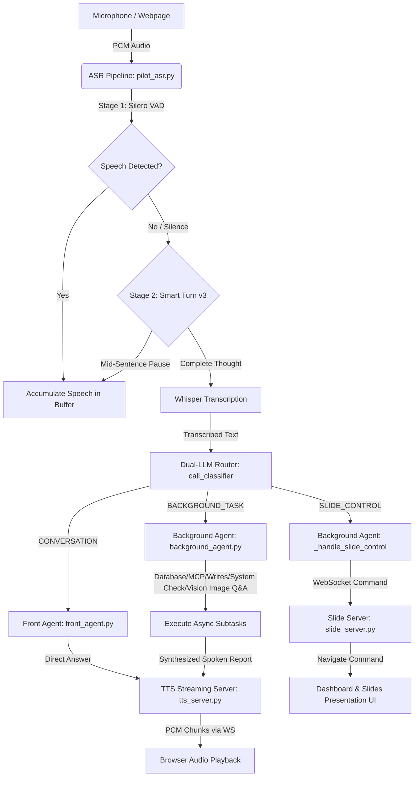

# PILOT: Real-Time AI Flight Assistant & Slide Controller

PILOT is a highly responsive, multimodal voice-controlled AI system. It features **two-stage voice activity detection (VAD)**, **speech normalisation**, and **smart turn detection** to process audio locally. An intelligent **Dual-LLM orchestration layer** routes simple conversational/slide commands through a low-latency front-end model while delegating heavier background queries (such as flight pricing lookups, filesystem indexing, or SQL database operations) to a multi-threaded background agent.

---

## 🏗️ Architecture Overview



### 1. Low-Latency ASR Pipeline (`pilot_asr.py`)
- **Audio DSP Processing:** Filters background hiss using an adaptive asymmetric `NoiseGate` and maintains speaker volume consistency using a peak-tracking `GainNormaliser` before queuing audio.
- **Stage 1: Silero VAD**: Detects physical vocal energy.
- **Stage 2: Smart Turn v3**: Prevents cutoffs on natural pauses.
- **Stage 3: STT Engine (Faster-Whisper)**: Transcribes the raw PCM arrays. The model is dynamically loaded from the `WHISPER_MODEL` environment variable (set to `small` in active config, or fallback defaults like `distil-large-v3` or `large-v3-turbo` in code config).
- **Stage 4: Voice Biometrics & Guardrails**: Resolves speaker identity and role vectors. Checks RBAC permissions before delegating tools.
- **Stage 5: Dual-LLM Routing**: Routes conversation to Front Agent or schedules tasks in the background.

### 2. Dual-LLM Orchestration Layer
- **Front Agent (`FrontLLM/front_agent.py`):** Fast interceptor + classifier. Automatically captures presentation commands like `"back"`, `"next"`, and `"go to slide 4"` with $0\text{ ms}$ model-latency. General conversation queries are routed directly through a high-speed local Ollama or OpenAI model.
- **Background Processing Agent (`BackgroundLLM/background_agent.py`):** Processes heavy tasks, executes external Model Context Protocol (MCP) servers, queries local SQL databases, performs math analysis, and generates scripts. When finished, it speaks results back through the user's TTS server.

### 3. Slide Presentation WebSocket Bridge (`slide_server.py` & `slides.html`)
- Serves a `reveal.js` presentation on `http://localhost:8001/`.
- Maintains WebSocket clients. Commands routed by the Background Agent to `POST /slide/command` are broadcasted to browser presentation windows in real-time, enabling instant slide changes.

### 4. Real-Time Flight MCP Server (`flight-mcp/`)
- A Node.js Model Context Protocol (MCP) server running over standard I/O.
- Utilizes the **Tavily Core API** to fetch live travel options, flight numbers, airline pricing, and scheduling, with structured JSON static fallbacks.

### 5. High-Fidelity TTS Server (`tts_server.py`)
- Integrates the state-of-the-art **Kokoro TTS v1.0** ONNX engine (`kokoro-v1.0.onnx`).
- Streams generated synthesized speech as chunked PCM data directly to browser websocket clients, supporting real-time **TTS playback interruption** (e.g. saying *"stop"* or *"wait"* halts the assistant mid-sentence).

---

## 🔌 System Prerequisites & Dependencies

### Python Environment
- Python **3.11+** (Highly recommended)
- Standard system tools: `portaudio` (required for microphone input via `PyAudio`).
  - **macOS:** `brew install portaudio`
  - **Linux:** `sudo apt-get install portaudio19-dev`

### Node.js Environment
- Node.js **18.0.0+** (Required for the Flight MCP server).

### Database Server
- Local portable **SQLite Database** (`pilot_voice.db`) automatically generated and verified inside your workspace, or an optional external **MySQL** instance.

---

## 🚀 Step-by-Step Launch Guide

To start this project in structured order, open 3 separate terminals inside the `/capstone` directory and run:

### Terminal 1: Run the TTS Server
The TTS server runs your Kokoro model on `http://localhost:8000/`.
```bash
# Make sure your python virtual environment is active
source .venv/bin/activate

# Start the uvicorn API server
uvicorn tts_server:app --reload
```

### Terminal 2: Start the WebSocket Slide Server
The slide server coordinates real-time browser transitions and manual sync on `http://localhost:8001/`.
```bash
source .venv/bin/activate

python slide_server.py
```

### Terminal 3: Launch the Voice ASR Controller Pipeline
This starts your audio microphone intake stream and wires your Front/Background LLM orchestration.
```bash
source .venv/bin/activate

# Setup environmental configurations for routing
export PILOT_LLM_PROVIDER="ollama"
export PILOT_LLM_MODEL="llama3.2"
export OLLAMA_URL="http://127.0.0.1:11434/api/chat"
export PILOT_TTS_SPEAK_URL="http://127.0.0.1:8000/speak"

# Set up local Database variables (Defaults to SQLite in local workspace path if omitted)
export PILOT_DATABASE_URL="sqlite:////Users/pagupta/Desktop/Capstone_project1_2/pilot_voice.db"

# Set up local Flight MCP variables
export PILOT_MCP_COMMAND="node"
export PILOT_MCP_ARGS="/Users/pagupta/Desktop/Capstone_project1_2/flight-mcp/index.js"
export PILOT_MCP_TOOL="search_flights_web"

# Run ASR pipeline
python pilot_asr.py
```

Now, open `http://localhost:8000/` in your web browser. Click **🎧 Enable Audio** and drop/upload your raw `.pptx` presentation.

---

## 🎙️ Spoken Instruction Guide (How to give commands to LLMs)

PILOT handles a wide range of multimodal commands. To trigger an action, speak your wake word first (e.g., `"Hey Pilot..."` or `"Pilot..."`), followed by your instruction.

### 📁 Category 1: Slide Navigation Commands
Directly intercepted with $0\text{ ms}$ model-latency by the Front LLM routing layer.

| Task / Operation | What to speak (Examples) | Action Performed |
| :--- | :--- | :--- |
| **Go Forward** | 🎙️ *"Next slide"* / *"Navigate forward"* / *"Next"* | Shifts presentation forward by one slide. |
| **Go Backward** | 🎙️ *"Previous slide"* / *"Go back"* / *"Back"* | Shifts presentation backward by one slide. |
| **Reset Deck** | 🎙️ *"First slide"* / *"Go to the beginning"* | Resets presentation to Slide 1. |
| **Jump to end** | 🎙️ *"Last slide"* / *"Go to the final slide"* | Shifts presentation directly to the final slide. |
| **Jump to Slide N** | 🎙️ *"Go to slide 4"* / *"Jump to slide 9"* | Navigates directly to the specified slide number. |

---

### 🎨 Category 2: Image & Presentation Q&A
Processes and extracts elements dynamically from the raw uploaded `.pptx` slides and executes Vision analysis on slides containing figures/diagrams.

| Task / Operation | What to speak (Examples) | Action Performed |
| :--- | :--- | :--- |
| **Explain Slides** | 🎙️ *"What is this presentation about?"* | Reads all slide texts in background and speaks a summary. |
| **Slide Content** | 🎙️ *"Summarize slide 3 for me"* | Reads slide 3's bullet points and summarizes them. |
| **Embedded Figures** | 🎙️ *"Explain the diagram on slide 5"* | Loads slide 5's embedded vector flowchart, analyzes it via Vision LLM, and explains the illustration. |
| **Analyze Graphics** | 🎙️ *"What is shown in the figure on slide 7?"* | Encodes slide 7's diagram as base64, runs Vision LLM context analysis, and details the chemical conversion. |

---

### ✈️ Category 3: Live Flights & MCP Searches
Bypasses static parameters to connect to live web directories utilizing Tavily API searches in real-time.

| Task / Operation | What to speak (Examples) | Action Performed |
| :--- | :--- | :--- |
| **Search Flights** | 🎙️ *"Search for direct flights from Mumbai to Delhi today"* | Launches Flight MCP stdio, fetches live schedules and prices, and speaks recommendations. |
| **Check Airfares** | 🎙️ *"What are today's ticket prices from Delhi to London?"* | Pulls latest online prices from booking engines (MakeMyTrip, Goibibo) and summarizes airfares. |

---

### 💾 Category 4: Local Workspace & Database Operations
Performs heavy background operations to query local databases, inspect system properties, or execute calculations.

| Task / Operation | What to speak (Examples) | Action Performed |
| :--- | :--- | :--- |
| **Query Records** | 🎙️ *"How many recordings are saved in our database?"* | Connects to your local MySQL instance and details saved recording count and meta summaries. |
| **System Check** | 🎙️ *"Inspect project directory files"* | Lists workspace directories and summarizes file counts. |
| **Heavy math** | 🎙️ *"Compute prime numbers up to 1000"* | Runs complex python mathematical calculations and structures findings. |

---

### 🛑 Category 5: Stream Interruption (Mute)
Halts Pilot's spoken TTS synthesizer output mid-sentence.

| Task / Operation | What to speak (Examples) | Action Performed |
| :--- | :--- | :--- |
| **Mute Pilot** | 🎙️ *"Stop"* / *"Wait"* / *"Pause"* / *"Be quiet"* | Instantly interrupts chunked PCM stream playback on the client. |


# terminal 1
PILOT_LLM_PROVIDER=ollama \
PILOT_LLM_MODEL=mistral:latest \
OLLAMA_URL=http://127.0.0.1:11434/api/chat \
PILOT_TTS_SPEAK_URL=http://127.0.0.1:8000/speak \
.venv/bin/python pilot_asr.py


# terminal 2
.venv/bin/python slide_server.py

# terminal 3
uvicorn tts_server:app --reload


export PILOT_MCP_COMMAND="node"export PILOT_MCP_ARGS="/Users/pagupta/Desktop/Capstone_project1_2/flight-mcp/index.js"
export PILOT_MCP_TOOL="search_flights"

PILOT_LLM_PROVIDER=ollama \
PILOT_LLM_MODEL=mistral:latest \
OLLAMA_URL=http://127.0.0.1:11434/api/chat \
PILOT_TTS_SPEAK_URL=http://127.0.0.1:8000/speak \
.venv/bin/python pilot_asr.py


PILOT_DATABASE_URL="sqlite:////absolute/path/to/my_database.db"


export PILOT_DATABASE_URL="sqlite:////Users/pagupta/Desktop/Capstone_project1_2/pilot_voice.db"